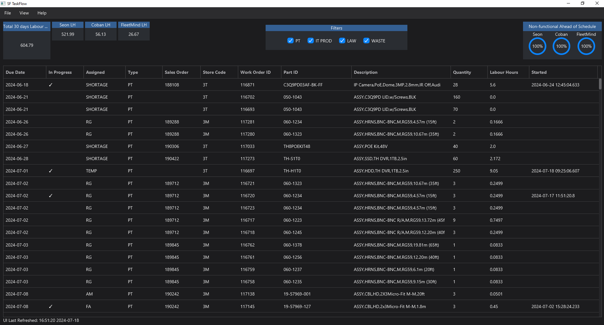

<h1 align="center">
  SFTaskFlow
</h1>

<h4 align="center">A minimalistic platform design for employee of SafeFleet Production to track work order assignment and progression.</h4>

  <a href="#key-features">Key Features</a> •
  <a href="#how-to-use">How To Use</a> •
  <a href="#download">Download</a> •
  <a href="#credits">Credits</a> •
  <a href="#related">Related</a> •
  <a href="#license">License</a>

## Key Features

* AutoRefresh Query - Keep updated!
    - See updates made to Expandable database without manual interaction for a more consistent and updated work experience
* Data Exports
    - Utilize the ability the power of exports to further the flow of information
      - Excel (xlsx)
      - CSV
* Full screen mode
    - Work and track your work distraction free.
* Cross-platform
    - Windows, macOS and Linux ready.

## How To Use

> **Note**
> This is a SafeFleet facility integrated software, not meant for outside use but is open-sourced for utilization in other means.

## Download
> **Note**
> This is a SafeFleet facility integrated software, installation files are kept on the SafeFleet internal network.
---
## Changelog
TODO (v2.0)
* [✓] Fix bug where data is appending to the table even when filtered
* [✓] Fix performance leak issue
* [✓] Add table column for user assignment [JCFJM JCFJM_USER_1]
* [✓] Add time started column [JCFKL DATE_MODIFIED]
* [✓] Add filter for IT Production

TODO (v2.5)
* [✓] Add feature to export
* [✓] Add filter to omit work order 102966
* [✓] Add setting for user to change refreshing rate of the table
* [✓] Add column to include SO# [JCFJM SO_ID]

TODO (v3.0)
* Add update software notification
* Add feature to print WO by clicking on table cell
* Add visual chart (stacked bar chart) for individual completion rate
* Implementation of a working ahead schedule tracker